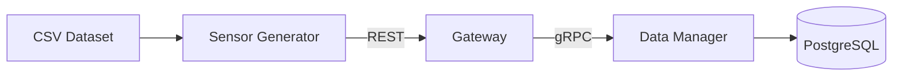

# Internet of Things and Services (IoTS)
Collection of projects developed for the university subject **Internet of Things and Services**.

The goal of these projects is to simulate an IoT system by generating sensor data from a real dataset and processing it through a microservice-based, containerized backend.

---

# System Architecture



---

# Project I - Data Management

## Overview
This project simulates ingestion and management of IoT sensor readings using a microservice architecture.

Sensor data is read from a _CSV_ dataset, sent through a **REST gateway**, forwarded via **gRPC** to a **data management** service, and finally stored in a **PostgreSQL** database.

---

## Services

### Data Manager
- **Language**: Go
- **Protocol**: gRPC
- **Database**: PostgreSQL
- **Responsibility**:
  Provides CRUD and aggregation operations over sensor readings.

  Proto definitions are located at:
  ```/datamanager/proto/reading.proto```

---

### Gateway
- **Language**: .NET
- **Protocol**: REST (client-facing), gRPC (internal)
- **Responsibility**:
Acts as an API gateway and translates REST requests into gRPC calls.

---

### Sensor Generator
- **Language**: Python
- **Type**: CLI Tool
- **Responsibility**:
Reads sensor data from _CSV_ and sends it to the _Gateway_ at configurable intervals.

## Design Decisions

### Microservice Architecture
The system is split into multiple services to clearly separate responsibilities and simulate a real-world IoT backend.
This design also aligns with the course requirements.

---

### REST for External, gRPC for Internal communication
REST is used for client-facing communication due to its simplicity and ease of integration.

gRPC is used for internal service-to-service communication, which is a common industry pattern and provides:
- Better performance over REST
- Binary serialization via Protocol Buffers
- Strongly typed service contracts

---

### Go for Data Management Service
The Data Manager is implemented in Go due to its:
- High performance
- Low memory usage
- Efficient database drivers (pgx)
An ORM was intentionally avoided in favor of direct SQL queries using _pgx_.
While this reduces convenience, it improves performance and keeps the implementation simple. With single data model and small amout of queries this was not a big problem.

# Project II - Event driven communication using MQTT

## Data Manager (modifications)

[View AsyncAPI in AsyncApi Studio](https://studio.asyncapi.com/?share=2f09cc15-830e-484f-9012-5eda290ad220)

# Dataset
Smoke Detection (Kaggle):
https://www.kaggle.com/datasets/deepcontractor/smoke-detection-dataset
