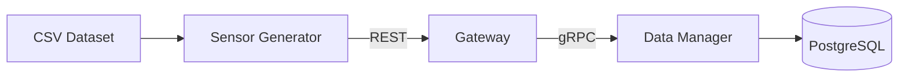

# Internet of Things and Services (IoTS)
Collection of projects developed for the university subject **Internet of Things and Services**.

The goal of these projects is to simulate an IoT system by generating sensor data from a real dataset and processing it through a microservice-based, containerized backend.

---

## System Architecture



---

## Project I - Data Management

### Overview

This project simulates ingestion and management of IoT sensor readings using a microservice architecture.

Sensor data is read from a _CSV_ dataset, sent through a **REST gateway**, forwarded via **gRPC** to a **data management** service, and finally stored in a **PostgreSQL** database.

---

### Services

### Data Manager
- **Language**: Go
- **Protocol**: gRPC
- **Database**: PostgreSQL
- **Responsibility**:
  Provides CRUD and aggregation operations over sensor readings.

  Proto definitions are located at:
  ```/datamanager/proto/reading.proto```

---

### Gateway
- **Language**: .NET
- **Protocol**: REST (client-facing), gRPC (internal)
- **Responsibility**:
Acts as an API gateway and translates REST requests into gRPC calls.

---

### Sensor Generator
- **Language**: Python
- **Type**: CLI Tool
- **Responsibility**:
Reads sensor data from _CSV_ and sends it to the _Gateway_ at configurable intervals.
