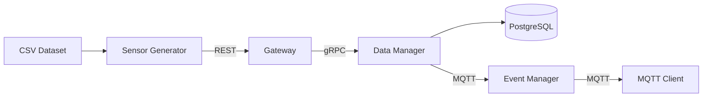

# Internet of Things and Services (IoTS)
Collection of projects developed for the university subject **Internet of Things and Services**.

The goal of these projects is to simulate an IoT system by generating sensor data from a real dataset and processing it through a microservice-based, containerized backend.

---

# System Architecture



---

# Project I - Data Management

## Overview
This project simulates ingestion and management of IoT sensor readings using a microservice architecture.

Sensor data is read from a _CSV_ dataset, sent through a **REST gateway**, forwarded via **gRPC** to a **data management** service, and finally stored in a **PostgreSQL** database.

---

## Services

### Data Manager
- **Language**: Go
- **Protocol**: gRPC
- **Database**: PostgreSQL
- **Responsibility**:
  Provides CRUD and aggregation operations over sensor readings.

  Proto definitions are located at:
  ```/datamanager/proto/reading.proto```

### Gateway
- **Language**: .NET
- **Protocol**: REST (client-facing), gRPC (internal)
Acts as an API gateway and translates REST requests into gRPC calls.

### Sensor Generator
- **Language**: Python
- **Type**: CLI Tool
- **Responsibility**:
Reads sensor data from _CSV_ and sends it to the _Gateway_ at configurable intervals.

---

## Design Decisions

### Microservice Architecture
The system is split into multiple services to clearly separate responsibilities and simulate a real-world IoT backend.
This design also aligns with the course requirements.

### REST for External, gRPC for Internal communication
REST is used for client-facing communication due to its simplicity and ease of integration.

gRPC is used for internal service-to-service communication, which is a common industry pattern and provides:
- Better performance over REST
- Binary serialization via Protocol Buffers
- Strongly typed service contracts

### Go for Data Management Service
The Data Manager is implemented in Go due to its:
- High performance
- Low memory usage
- Efficient database drivers (pgx)
An ORM was intentionally avoided in favor of direct SQL queries using _pgx_.
While this reduces convenience, it improves performance and keeps the implementation simple. With single data model and small amout of queries this was not a big problem.

---

# Project II - Event driven communication using MQTT

## Overview
This phase introduces event-driven communication for real-time processing.

The system now uses MQTT for internal communication of its microservices. One service sends raw IoT reading data, another service consumes it, checks for thresholds and sends events (_Smoke Event_) to another topic.

Small CLI app is developed to consume _Smoke Events_ and display them in console.

---

## Services

### Mosquitto Message Broker
Mosquitto is used as a message broker, running as a docker container listening on port ```1883```

### Modified Data Manager
- **New Responsibility**:
Upon creating new sensor reading, either from ```Create``` or ```BatchCreate``` function, it also publishes each reading as a message to ```data-manager/raw-readings``` topic, without modifying nor deleting fields from model.

Async api specification is at ```/data-manager/data-manager-async-api.yaml```, or:
[View AsyncAPI in AsyncApi Studio](https://studio.asyncapi.com/?share=56aed91b-f696-4693-8d2b-9cc0fced1fa0)

### Event Manager
- **Language**: Go
- **Protocol**: MQTT
- **Responsibility**:
Consume messages from ```data-manager/raw-readings``` topic, if certain fields exceed configurable thresholds, then create **Smoke Event** model with more details about the reading and the exceeding thresholds, and publish it to ```event-manager/threshold-readings``` topic

Async api specification is at ```/event-manager/event-manager-async-api.yaml```, or:
[View AsyncApi in AsyncAPi Studio](https://studio.asyncapi.com/?share=969ab085-2900-4d76-9b4e-8e9355422e6e)

### MQTT Client
- **Language**: Python
- **Type**: CLI Tool
- **Responsibility**:
Consume messages from ```event-manager/threshold-readings``` and display them on console.

---

## Design Decisions

### Data Manager publishing entire Reading object
Data manager is just responsible for notifying its listeners about newly created readings. It doesn't know how clients will use those readings so it sends all of the data about the reading.

### Go for Event Manager
Similarly for Data Manager, this microservice needs to fast. Events that it sends, for this example, are early warning signs of fire.
Go is fast and reliable for this use case.

---

# Dataset
Smoke Detection (Kaggle):
https://www.kaggle.com/datasets/deepcontractor/smoke-detection-dataset
