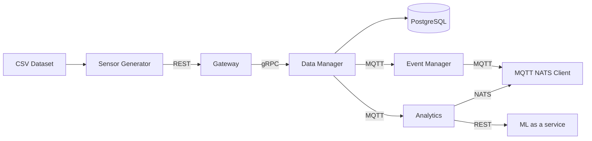

# Internet of Things and Services (IoTS)
Collection of projects developed for the university subject **Internet of Things and Services**.

The goal of these projects is to simulate an IoT system by generating sensor data from a real dataset and processing it through a microservice-based, containerized backend.

---

# Table of Contents

- [Internet of Things and Services (IoTS)](#internet-of-things-and-services-iots)
- [Table of Contents](#table-of-contents)
- [System Architecture](#system-architecture)
- [How to Run](#how-to-run)
  - [Prerequisites](#prerequisites)
    - [Step 1. Clone the project](#step-1-clone-the-project)
    - [Step 2. Navigate to Docker configuration folder](#step-2-navigate-to-docker-configuration-folder)
    - [Step 3. Create a copy of the example environment file](#step-3-create-a-copy-of-the-example-environment-file)
    - [Step 4. Run the server](#step-4-run-the-server)
    - [5. Running the client tools](#5-running-the-client-tools)
    - [6. Docker cleanup](#6-docker-cleanup)
- [Project I - Data Management](#project-i---data-management)
  - [Overview](#overview)
  - [Services](#services)
    - [Data Manager](#data-manager)
    - [Gateway](#gateway)
    - [Sensor Generator](#sensor-generator)
  - [Design Decisions](#design-decisions)
    - [Microservice Architecture](#microservice-architecture)
    - [REST for External, gRPC for Internal communication](#rest-for-external-grpc-for-internal-communication)
    - [Go for Data Management Service](#go-for-data-management-service)
- [Project II - Event driven communication using MQTT](#project-ii---event-driven-communication-using-mqtt)
  - [Overview](#overview-1)
  - [Services](#services-1)
    - [Mosquitto Message Broker](#mosquitto-message-broker)
    - [Modified Data Manager](#modified-data-manager)
    - [Event Manager](#event-manager)
    - [MQTT Client](#mqtt-client)
  - [Design Decisions](#design-decisions-1)
    - [Data Manager publishing entire Reading object](#data-manager-publishing-entire-reading-object)
    - [Go for Event Manager](#go-for-event-manager)
- [Project III - Machine Learning as a Service](#project-iii---machine-learning-as-a-service)
  - [Overview](#overview-2)
  - [Services](#services-2)
    - [MLAAS](#mlaas)
    - [Analytics](#analytics)
    - [Modified MQTT Client](#modified-mqtt-client)
  - [Design Decisions](#design-decisions-2)
    - [Deep learning for this dataset](#deep-learning-for-this-dataset)
- [Smoke Detection Dataset (Kaggle)](#smoke-detection-dataset-kaggle)

---

# System Architecture


```mermaid
graph LR
    CSV[CSV Dataset] --> SG[Sensor Generator]
    SG -->|REST| GW[Gateway]
    GW -->|gRPC| DM[Data Manager]
    DM --> DB[(PostgreSQL)]
    DM -->|MQTT| EM[Event Manager]
    EM -->|MQTT| MQT[MQTT NATS Client]
    DM -->|MQTT| AN[Analytics]
    AN -->|REST| MLAAS[ML as a service]
    AN -->|NATS| MQT[MQTT NATS Client]
```

---

# How to Run
You only need to have ```docker``` and ```docker compose``` in order to test entire application.

---

## Prerequisites
- Docker – [Install guide](https://docs.docker.com/engine/install)
- Docker Compose – [Install guide](https://docs.docker.com/compose/install)

Make sure Docker is running before proceeding.

### Step 1. Clone the project 
```bash
git clone https://github.com/cjovan02/iots.git
cd iots
```

### Step 2. Navigate to Docker configuration folder
```bash
cd ./docker
```

This folder contains **docker configuration** to run the services.

### Step 3. Create a copy of the example environment file
```bash
cp .env.example .env
```

It's recommended to change ```POSTGRES_USER``` and ```POSTGRES_PASSWORD``` for security,
but for testing purposes, the defaults will work.
You can also tweak other environment variables if needed.

### Step 4. Run the server
```bash
docker compose up --build
```

This will start all microservices, the database, message brokers, and Adminer.

Some ports of the server are exposed to the host:
|    Service    |               URL             |    Port   |    Description            |
| ------------- | ------------------------------| --------- | ------------------------- |
| Swagger UI    | http://localhost:7002/swagger |   7002    | REST API Documentation    |
| Adminer       | http://localhost:7000         |   7000    | Database Management UI    |
| MLAAS         | http://localhost:7003/docs    |   7003    | MLAAS REST API Docs       |
| NATS          | http://localhost:8222         |   8222    | NATS Broker Monitoring    |

This means you can visit ```http://localhost:7002/swagger``` to explore the API.
Or you can visit the adminer at ```http://localhost:7000``` to see database data.

### 5. Running the client tools
The project includes simple CLI Python clients for testing:
1. **mqtt-nats-client** - prints events from the server:
```bash
docker compose run --rm mqtt-nats-client
```

2. **sensor-generator** - simulates sensor readings from a CSV file:
```bash
docker compose run --rm sensor-generator
```

> I suggest starting the _mqtt-nats-client_ before _sensor-generator_ because _mqtt-client_ will print events caused by _sensor-generator_.

### 6. Docker cleanup
```bash
docker compose down -v
```
This will delete all containers created previously.

---

# Project I - Data Management

## Overview
This project simulates ingestion and management of IoT sensor readings using a microservice architecture.

Sensor data is read from a _CSV_ dataset, sent through a **REST gateway**, forwarded via **gRPC** to a **data management** service, and finally stored in a **PostgreSQL** database.

---

## Services

### Data Manager
- **Language**: Go
- **Protocol**: gRPC
- **Database**: PostgreSQL
- **Responsibility**:
  Provides CRUD and aggregation operations over sensor readings.

  Proto definitions are located at:
  ```/datamanager/proto/reading.proto```

### Gateway
- **Language**: .NET
- **Protocol**: REST (client-facing), gRPC (internal)
Acts as an API gateway and translates REST requests into gRPC calls.

### Sensor Generator
- **Language**: Python
- **Type**: CLI Tool
- **Responsibility**:
Reads sensor data from _CSV_ and sends it to the _Gateway_ at configurable intervals.

---

## Design Decisions

### Microservice Architecture
The system is split into multiple services to clearly separate responsibilities and simulate a real-world IoT backend.
This design also aligns with the course requirements.

### REST for External, gRPC for Internal communication
REST is used for client-facing communication due to its simplicity and ease of integration.

gRPC is used for internal service-to-service communication, which is a common industry pattern and provides:
- Better performance over REST
- Binary serialization via Protocol Buffers
- Strongly typed service contracts

### Go for Data Management Service
The Data Manager is implemented in Go due to its:
- High performance
- Low memory usage
- Efficient database drivers (pgx)
An ORM was intentionally avoided in favor of direct SQL queries using _pgx_.
While this reduces convenience, it improves performance and keeps the implementation simple. With single data model and small amount of queries this was not a big problem.

---

# Project II - Event driven communication using MQTT

## Overview
This phase introduces event-driven communication for real-time processing.

The system now uses MQTT for internal communication of its microservices. One service sends raw IoT reading data, another service consumes it, checks for thresholds and sends events (_Smoke Event_) to another topic.

Small CLI app is developed to consume _Smoke Events_ and display them in console.

---

## Services

### Mosquitto Message Broker
Mosquitto is used as a message broker, running as a docker container listening on port ```1883```

### Modified Data Manager
- **New Responsibility**:
Upon creating new sensor reading, either from ```Create``` or ```BatchCreate``` function, it also publishes each reading as a message to ```data-manager/raw-readings``` topic, without modifying nor deleting fields from model.

Async api specification is at ```/data-manager/data-manager-async-api.yaml```, or:

[View AsyncAPI in AsyncAPI Studio](https://studio.asyncapi.com/?share=1108b914-7669-4c68-b248-7f1930a206ac)

### Event Manager
- **Language**: Go
- **Protocol**: MQTT
- **Responsibility**:
Consume messages from ```data-manager/raw-readings``` topic, if certain fields exceed configurable thresholds, then create **Smoke Event** model with more details about the reading and the exceeding thresholds, and publish it to ```event-manager/threshold-readings``` topic

Async api specification is at ```/event-manager/event-manager-async-api.yaml```, or:

[View AsyncApi in AsyncAPi Studio](https://studio.asyncapi.com/?share=bd83ee26-da35-445b-b7ee-cf21541c1382)

### MQTT Client
- **Language**: Python
- **Type**: CLI Tool
- **Responsibility**:
Consume messages from ```event-manager/threshold-readings``` and display them on console.

---

## Design Decisions

### Data Manager publishing entire Reading object
Data manager is just responsible for notifying its listeners about newly created readings. It doesn't know how clients will use those readings so it sends all of the data about the reading.

### Go for Event Manager
Similarly for Data Manager, this microservice needs to fast. Events that it sends, for this example, are early warning signs of fire.
Go is fast and reliable for this use case.

---

# Project III - Machine Learning as a Service

## Overview
This phase focuses on analysing the input sensor readings using the trained deep learning model.

Model was trained using neural network with LSTM as a middle layer. Model is then loaded in the service and is offered as REST API endpoint to predict the fire in the near future.

Another service was built to use this REST API to analyse the input sensor readings and send the result to NATS broker.

Previously built ```mqtt-client``` was modified to print the messages from NATS broker.

Due to the limited number of fire events in the dataset, the model is not intended for production use, but rather as a proof of concept for early fire detection.

---

## Services

### MLAAS
- **Language**: Python
- **Web Framework**: Fast API
- **ML Training Library**: Keras
- **Responsibility**:
Train the model and offer it as a service through REST API. Result of the training is inside _MLAAS_ folder.

### Analytics
- **Language**: Go
- **Protocols**: MQTT and NATS
- **Responsibility**
Subscribe to ```data-manager/raw-readings``` MQTT topic to collect the data for analysing. Once enough data is collected, send it to ```MLAAS``` to predict the fire, then publish that result to ```analytics.predictions``` NATS subject.

[View AsyncApi in AsyncAPi Studio](https://studio.asyncapi.com/?share=bfa23147-f2db-431b-ad2e-9fdb52c3dc3d)


### Modified MQTT Client
- **New Name**: mqtt-nats-client
- **New Responsibility**:
Print messages to console from ```analytics.predictions``` NATS subject.

---

## Design Decisions

### Deep learning for this dataset
Neural network using LSTM as a middle layer was used to train the model with sliding window of 40 with regression.

Since dataset only has classification of 0 _(no fire)_ and 1 _(fire)_, I decided its better to use regression between 0 and 1. 
0 means there is no fire in the future, 1 means that the fire is currently going, and 0.8, for example, means that there is a high chance for fire in the near future.

I modified dataset a bit: 
around 500 readings before the fire starts, linarly increase the _Y_ value. This results in linear increase of chance of fire in the near future. This way to model can train on this event, before the fire starts. This is the most important situation that model should be able to predict, to detect the early warning signs before the fire starts.

Since the dataset only has 2 fire events, which is not enough to create a good model, we can't effectively train the model for this situation. One event before the fire starts was used for training, and the other one was used for testing.

The results of the testing can be found in ```MLAAS``` folder.

---

# Smoke Detection Dataset (Kaggle)

Used for simulating sensor readings and training the ML model.

🔗 https://www.kaggle.com/datasets/deepcontractor/smoke-detection-dataset